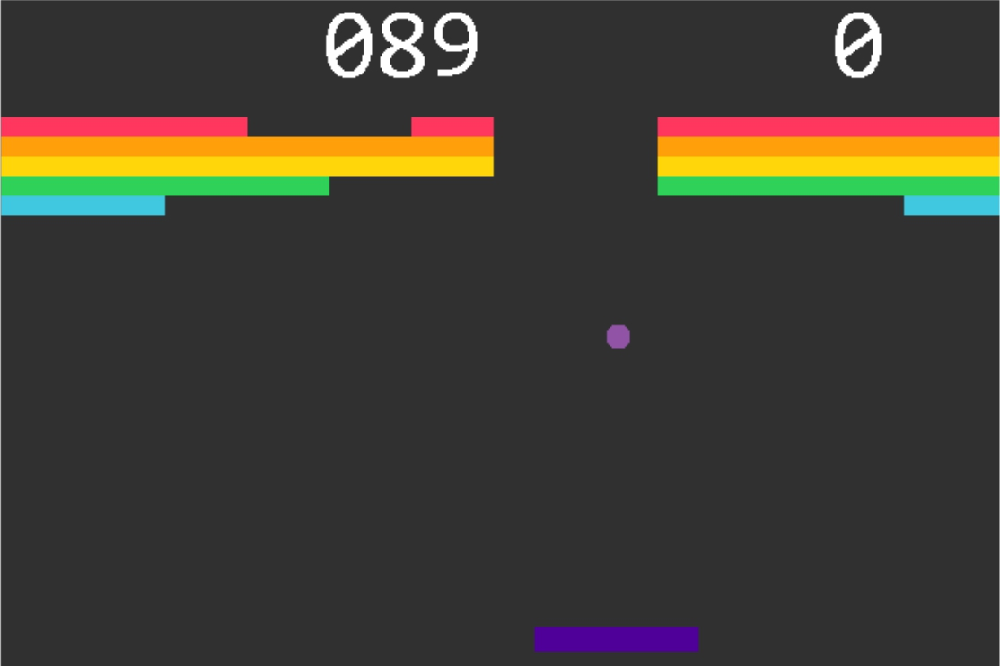

# Atari Breakout Game
 
In this project I implement my own version of the Atari Breakout game using Java. I implemented a GUI.

In order to run the game you just need to compile and run the file called <code>Breakout.java</code>.
